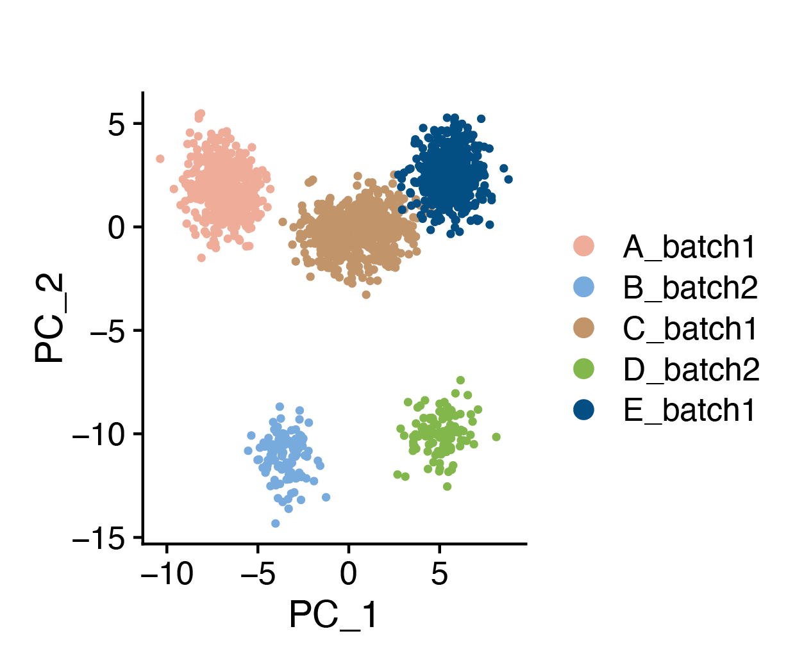
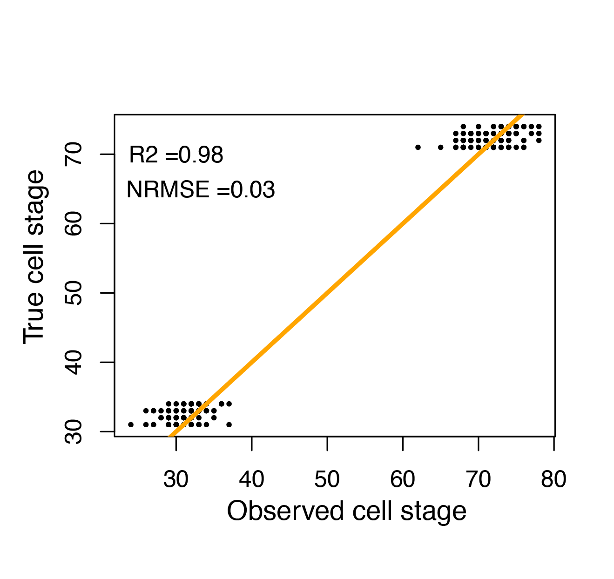
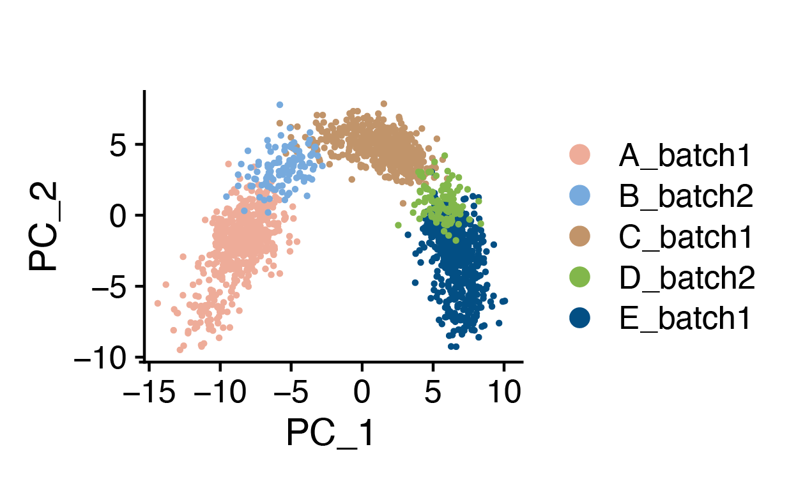

# scStalt (single-cell stage label transfer) 

## Summary
scStalt porvides a scalable ultrafast method to annotate cell states under the reference-query mode. It extracts the trajectory associated differentially expressed genes from reference dataset and then smoothed the genes to form a kernel expression profile with which query cells are assigned to their corresponding stages. The method can also be utilized to perform integration with non-representative datasets from the same trajectory.

In this tutorial, we will generate two non-representative datasets differential datasets, each encompassing varied cellular stages. And then we will use scStalt to infer the psuedotime of the query dataset as well as integrate the two datasets with batch correction. 


## Installation

To install:

```
library(devtools)
devtools::install_github("DengLab-KI/scStalt")
```

## Preparation

We will load two dataset, b1_sub and b2_sub, which are two mosaic datasets:
(1)b1_sub and b2_sub are two batches of cells that belong to the same simulated cell differentation 
   process from step 1 to step 100; (codes for generating b1_sub and b2_sub is available in )
(2)b1_sub and b2_sub contains different cell stages. Here we have b1_sub containning cells from step 1-20, 40-60 and 80-100, 
   whereas b2_sub containing cells from step 30-35 and 70-75
In this case, current trajectory inference (TI) methods could not infer differentiation stages for b2_sub. Meanwhile, current integration methods such as Seurat CCA, MNN or Harmony could not perfectly integrate b_sub1 and b_sub2 since they are mosaic. For details, please refer to our [benchmark result](https://github.com/DengLab-KI/scStalt_BenchmarkingResult).


```{r loadpkg,echo=T,message=FALSE,warning=F}
#Load the required packages 
suppressMessages(library(Seurat))
suppressMessages(library(slingshot))
suppressMessages(library(splatter))
suppressMessages(library(RColorBrewer))
suppressMessages(library(tradeSeq))
suppressMessages(library(SeuratWrappers))
suppressMessages(library(harmony))
suppressMessages(library(scater))
suppressMessages(library(mclust, quietly = TRUE))
suppressMessages(library(MLmetrics))
suppressMessages(library(scStalt))

#set the colors for plotting 
clustercol=c("#eeac99", "#77AADD", "#c1946a", "#82b74b", "#034f84",  "#b8a9c9", "#F5DEB3", "#7e4a35") 

#load the single-cell simulated data set.
load("./data/b1_sub.Rda")
load("./data/b2_sub.Rda")
```

Before using scStalt, we can first take a look at the data.

```{r loadData,echo=T,message=FALSE,warning=F}
# merge the two datasets
bm = merge(b1_sub,b2_sub)

#the cell group information is stored in "col" 
t = data.frame(table(bm$col))
colnames(t) = c("Cell type","Cell number")
#Here we can see the cell groups of the merged data
knitr::kable(t, "simple")

#Next,let's take a look at the batch effect between the two datasets
#We will just run normal Seurat pipeline on the merged datasets and then
#check the cell batch and cell group information on the PCA plot
bm = NormalizeData(bm,verbose = F)
bm = FindVariableFeatures(bm,verbose = F)
bm = ScaleData(bm ,verbose = F)
bm = RunPCA(bm ,verbose = F)
```

```
#Below we plot the cell batch information on the PCA plot
DimPlot(bm ,group.by = "Batch",
        reduction = "pca",
        cols = c("#92a8d1","#3e4444"))+coord_fixed(ratio=1)
        
#We can see clearly that the two batches of cells are seperated disregarding 
#that they are cells from the same differentiaon process
```
```
#We can also see the cell process
DimPlot(bm ,group.by = "col",
        reduction = "pca",
        cols = clustercol)+coord_fixed(ratio=1)
#As expected, there is no clear structure regarding cell process from 
#undifferentiated cell to differentiated cells.
```


## scStalt workflow
scStalt is written to solve the aforementioned problem. The method basically has three steps

#### Step 1
First we will need to infer the pseudotime trajectory using the reference dataset (b1_sub in this case). In this tutorial, 
we used R package [Slingshot](https://github.com/kstreet13/slingshot). Other trajectory inference methods should also work.
```{r Step1, echo=T,message=F,warning=F}
#for details, please refer to Slingshot
b_sub = b1_sub
b_sub <- NormalizeData(b_sub, normalization.method = "LogNormalize")
b_sub <- FindVariableFeatures(b_sub,selection.method = "vst", nfeatures = 3000)
pca <- prcomp(t(b_sub@assays$originalexp@data[VariableFeatures(object = b_sub),]), scale. = FALSE)
data =  pca$x[,1:2]
cl1 <- Mclust( pca$x[,1:2])
cl1 = cl1$classification
b_sub[["mclust"]] = cl1
b_sub.sce = as.SingleCellExperiment(b_sub)
reducedDims(b_sub.sce) = SimpleList(PCA = data)
colData(b_sub.sce)$GMM = cl1
b_sub.sce = slingshot(b_sub.sce, clusterLabels = 'GMM', reducedDim = 'PCA')
pseudotime = slingPseudotime(b_sub.sce,na=F)
cellWeights = slingCurveWeights(b_sub.sce)
```

#### Step 2
Next, we will obtian the kernel gene expression profile using function doKernel. This is to obtain a reletively continous profile with the state-of-art dynamic genes during the cell transition process.

```{r Step2,echo=T,message=F,warning=F}
library(scStalt)
ref = doKernel(count=b1_sub@assays$originalexp@counts, pseudotime = pseudotime, cellWeights = cellWeights, nGenes = 2000, nKnots = 5,nPoints = 100, fdr = 0.05)
#the paramater nKnots can be optimized using tradeSeq pipeline
```

| | Stage 1 | Stage 2| ... | Stage n|
| ------------- | ------------- |------------- |------------- |------------- |
| Gene 1 | v11  | v12 | ... | v1n |
| Gene 2| v21 | v22 |	... | v2n|
| ... | 	... | ...|	...|
| Gene k | vk1 |	vk2 | ...|vkn|

#### Step 3
Now that we have the kernel profile with trajecotry associated dynamic genes in evenly placed pseudo points, we can use the function assgnStage to infer the cell stages of the cells of the query (b2_sub in this case).

```{r Step3,echo=T,message=F,warning=F}
query_b2 = b2_sub@assays$originalexp@data[rownames(ref),]
query_b2 = as.data.frame(query_b2)
query_id = stageAssign(count = query_b2,kernel = log2(ref+1))
query_id = as.data.frame(query_id)
query_id$lineage_cosine = as.numeric(query_id$lineage_cosine)
query_id$score_cosine = as.numeric(query_id$score_cosine)

#Since it's simulated data, we can compare the true cell stages and the scStalt inferred stages.
query_id$step =  b2_sub$Step
NRMSE = RMSE(query_id$lineage_cosine,query_id$step)/99
R2 = R2_Score(query_id$lineage_cosine,query_id$step)
```

```
plot(query_id$lineage_cosine,
     query_id$step,pch=16,cex=.5,
     xlab="Observed cell stage",
     ylab="True cell stage")
lines(x=1:100,y=1:100, lwd = 3, col = 'orange')
text(x = 30, y = 70, labels = paste0("R2 =",round(R2,2)))
text(x = 33, y = 65, labels = paste0("NRMSE =",round(NRMSE,2)))

```


#### Data integration
In despite of the trajectory inference through reference-query, our method can also be used to integrate the two datasets.
We will use the psuedotime kernel profile of the reference to generate pseudo anchors. And then through assignsing the cells to these anchors, we can scale their gene expressions and therefore remove batch effects with function staltIntegration.

```{r integration, echo=T,message=F,warning=F}
count1= as.data.frame(b1_sub@assays$originalexp@counts)
count2=as.data.frame(b2_sub@assays$originalexp@counts)
bm_stalt_corrected =staltIntegration(count1=count1,count2=count2, genes=VariableFeatures(bm), nPoints = 100,ref=ref)
```
We can check the removal of batch effect by PCA plot on the corrected data.
```{r checkIntegration, echo=T,message=F,warning=F}
bm_stalt_corrected = CreateSeuratObject(bm_stalt_corrected)
bm_stalt_corrected$batch = bm$Batch
bm_stalt_corrected$col = bm$col
bm_stalt_corrected$step = c(b1_sub$Step,b2_sub$Step)
#bm_stalt_corrected$lineage =c(b1_id$lineage_cosine,b2_id$lineage_cosine)
bm_stalt_corrected = NormalizeData(bm_stalt_corrected)
bm_stalt_corrected = FindVariableFeatures(bm_stalt_corrected)
bm_stalt_corrected = ScaleData(bm_stalt_corrected )
bm_stalt_corrected = RunPCA(bm_stalt_corrected ) 
```
```
DimPlot(bm_stalt_corrected ,group.by = "batch",
        reduction = "pca",
        cols = c("#92a8d1","#3e4444"))+coord_fixed(ratio=1)
```



```
DimPlot(bm_stalt_corrected ,group.by = "col",
        cols = clustercol,
        pt.size = .5)+coord_fixed(ratio=1)
```

```{r checkBatch, echo=FALSE,warning=F,message=FALSE}
sessionInfo
R version 4.1.1 (2021-08-10)
Platform: x86_64-apple-darwin17.0 (64-bit)
Running under: macOS Monterey 12.5

Matrix products: default
LAPACK: /Library/Frameworks/R.framework/Versions/4.1/Resources/lib/libRlapack.dylib

locale:
[1] en_GB.UTF-8/en_GB.UTF-8/en_GB.UTF-8/C/en_GB.UTF-8/en_GB.UTF-8

attached base packages:
[1] parallel  stats4    stats    
[4] graphics  grDevices utils    
[7] datasets  methods   base 


other attached packages:
 [1] MLmetrics_1.1.1            [2] mclust_5.4.7                [3] scater_1.20.1               [4] ggplot2_3.3.5              
 [5] scuttle_1.2.0              [6] harmony_0.1.0               [7] Rcpp_1.0.7                  [8] SeuratWrappers_0.3.0       
 [9] tradeSeq_1.6.0             [10] RColorBrewer_1.1-2         [11] splatter_1.16.1            [12] slingshot_2.0.0            
[13] TrajectoryUtils_1.0.0      [14] SingleCellExperiment_1.14.1[15] SummarizedExperiment_1.22.0[16] Biobase_2.52.0             
[17] GenomicRanges_1.44.0       [18] GenomeInfoDb_1.28.1        [19] IRanges_2.26.0             [20] S4Vectors_0.30.0           
[21] BiocGenerics_0.38.0        [22] MatrixGenerics_1.4.2       [23] matrixStats_0.60.0         [24] princurve_2.1.6            
[25] SeuratObject_4.0.2         [26] Seurat_4.0.3.9015.         [27] scStalt_0.1.0 


loaded via a namespace (and not attached):
[1] utf8_1.2.2                  [2] reticulate_1.20             [3] R.utils_2.10.1              [4] tidyselect_1.1.1         
[5] htmlwidgets_1.5.3           [6] grid_4.1.1                  [7] combinat_0.0-8              [8] docopt_0.7.1             
[9] BiocParallel_1.26.1         [10] Rtsne_0.15                 [11] munsell_0.5.0              [12] ScaledMatrix_1.0.0       
[13] codetools_0.2-18           [14] ica_1.0-2                  [15] future_1.21.0              [16] miniUI_0.1.1.1           
[17] withr_2.4.2                [18] colorspace_2.0-2           [19] fastICA_1.2-2              [20] highr_0.9                
[21] knitr_1.33                 [22] rstudioapi_0.13            [23] ROCR_1.0-11                [24] tensor_1.5               
[25] listenv_0.8.0              [26] labeling_0.4.2             [27] slam_0.1-48                [28] GenomeInfoDbData_1.2.6   
[29] polyclip_1.10-0            [30] farver_2.1.0               [31] pheatmap_1.0.12            [32] parallelly_1.27.0        
[33] vctrs_0.3.8                [34] generics_0.1.0             [35] xfun_0.24                  [36] lsa_0.73.2               
[37] R6_2.5.0                   [38] ggbeeswarm_0.6.0           [39] rsvd_1.0.5                 [40] VGAM_1.1-6               
[41] locfit_1.5-9.4             [42] bitops_1.0-7               [43] spatstat.utils_2.2-0       [44] DelayedArray_0.18.0      
[45] assertthat_0.2.1           [46] promises_1.2.0.1           [47] scales_1.1.1               [48] beeswarm_0.4.0           
[49] gtable_0.3.0               [50] beachmat_2.8.0             [51] globals_0.14.0             [52] goftest_1.2-2            
[53] rlang_0.4.11               [54] splines_4.1.1              [55] lazyeval_0.2.2             [56] spatstat.geom_2.2-2      
[57] checkmate_2.0.0            [58] yaml_2.2.1                 [59] BiocManager_1.30.16        [60] reshape2_1.4.4           
[61] abind_1.4-5                [62] backports_1.2.1            [63] httpuv_1.6.1               [64] tools_4.1.1              
[65] ellipsis_0.3.2             [66] spatstat.core_2.3-0        [67] ggridges_0.5.3             [68] plyr_1.8.6               
[69] sparseMatrixStats_1.4.0    [70] zlibbioc_1.38.0            [71] purrr_0.3.4                [72] RCurl_1.98-1.3           
[73] densityClust_0.3           [74] rpart_4.1-15               [75] deldir_0.2-10              [76] pbapply_1.4-3            
[77] viridis_0.6.1              [78] cowplot_1.1.1              [79] zoo_1.8-9                  [80] ggrepel_0.9.1            
[81] cluster_2.1.2              [82] magrittr_2.0.1             [83] data.table_1.14.0          [84] scattermore_0.7          
[85] lmtest_0.9-38              [86] RANN_2.6.1                 [87] SnowballC_0.7.0            [88] fitdistrplus_1.1-5       
[89] evaluate_0.14              [90] patchwork_1.1.1            [91] mime_0.11                  [92] xtable_1.8-4             
[93] sparsesvd_0.2              [94] gridExtra_2.3              [95] HSMMSingleCell_1.12.0      [96] compiler_4.1.1           
[97] tibble_3.1.3               [98] KernSmooth_2.23-20         [99] crayon_1.4.1               [100] R.oo_1.24.0              
[101] htmltools_0.5.1.1         [102] mgcv_1.8-36               [103] later_1.2.0               [104] tidyr_1.1.3              
[105] DBI_1.1.1                 [106] MASS_7.3-54               [107] Matrix_1.3-4              [108] cli_3.0.1                
[109] R.methodsS3_1.8.1         [110] igraph_1.2.6              [111] pkgconfig_2.0.3           [112] plotly_4.9.4.1           
[113] spatstat.sparse_2.0-0     [114] vipor_0.4.5               [115] XVector_0.32.0            [116] stringr_1.4.0            
[117] digest_0.6.27             [118] sctransform_0.3.2         [119] RcppAnnoy_0.0.19          [120] DDRTree_0.1.5            
[121] spatstat.data_2.1-0       [122] rmarkdown_2.9             [123] leiden_0.3.9              [124] uwot_0.1.10              
[125] edgeR_3.34.0              [126] DelayedMatrixStats_1.14.2 [127] shiny_1.6.0               [128] lifecycle_1.0.0          
[129] monocle_2.20.0            [130] nlme_3.1-152              [131] jsonlite_1.7.2            [132] BiocNeighbors_1.10.0     
[133] viridisLite_0.4.0         [134] limma_3.48.3              [135] fansi_0.5.0               [136] pillar_1.6.2             
[137] lattice_0.20-44           [138] fastmap_1.1.0             [139] httr_1.4.2                [140] survival_3.2-11          
[141] glue_1.4.2                [142] remotes_2.4.0             [143] qlcMatrix_0.9.7           [144] FNN_1.1.3                
[145] png_0.1-7                 [146] stringi_1.7.3             [147] BiocSingular_1.8.1        [148] dplyr_1.0.7              
[149] irlba_2.3.3               [150] future.apply_1.7.0       
```

# Citation

# Contact
Qing Luo (qing.luo@ki.se), 
Qiaolin Deng (qiaolin.deng@ki.se)
